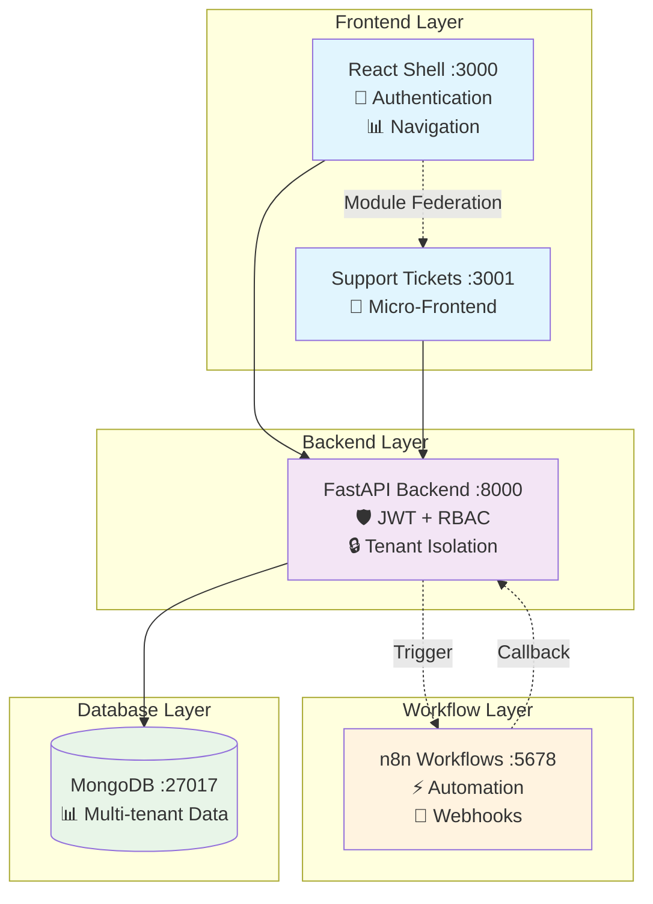

# Flowbit Multi-Tenant Application

A multi-tenant application demonstrating secure JWT authentication, RBAC, Module Federation, and n8n workflow automation.

## 🏗️ System Architecture



## 🎬 Demo Video

**[📹 3-Minute Demo Video Placeholder]**

*Shows: Tenant isolation, Module Federation, JWT auth, n8n workflow round-trip*

## ✨ Key Features

- **🔐 Tenant-Aware Authentication** - JWT with customer_id + role
- **🛡️ RBAC Security** - Admin/User role restrictions
- **🧩 Module Federation** - Dynamic micro-frontend loading
- **🔒 Data Isolation** - Complete tenant separation
- **⚡ Workflow Automation** - n8n integration with webhooks

## 🚀 Quick Setup

### Prerequisites
- **Docker Desktop** - [Download here](https://docs.docker.com/get-docker/)

### One-Command Setup

```bash
# Clone and start everything
git clone <repository-url>
cd flowbit-multitenant-app
docker-compose up --build
```

**That's it!** All services will start automatically:

- 🌐 **Frontend Shell**: http://localhost:3000
- 🎫 **Support Tickets**: http://localhost:3001
- 📡 **Backend API**: http://localhost:8000/docs
- ⚡ **n8n Workflows**: http://localhost:5678

### 🔐 Test Accounts

| Tenant | Role | Login | Password |
|--------|------|-------|----------|
| TenantA | Admin | `admin@tenantA.com` | `password` |
| TenantA | User | `user@tenantA.com` | `password` |
| TenantB | Admin | `admin@tenantB.com` | `password` |

## 🎯 Demo Flow

1. **Login** as `admin@tenantA.com / password`
2. **Create ticket** - watch it appear instantly
3. **See n8n workflow** process the ticket (5 seconds)
4. **Status changes** from "Open" → "Processed"
5. **Switch tenants** - verify complete data isolation

## 🔧 Individual Docker Builds

```bash
# Build services separately
docker build -t flowbit-backend ./backend
docker build -t flowbit-shell ./frontend/shell
docker build -t flowbit-tickets ./frontend/support-tickets-app

# Start with docker-compose
docker-compose up
```

## 🧪 Testing

```bash
# Run tenant isolation tests
docker exec flowbit-backend pytest tests/test_tenant_isolation.py -v
```

---

**Built with**: FastAPI • React • Module Federation • MongoDB • n8n • Docker