# Flowbit Multi-Tenant Application

A multi-tenant application demonstrating secure JWT authentication, RBAC, Module Federation, and n8n workflow automation.

## 🏗️ System Architecture

```mermaid
graph TB
    subgraph "Frontend Layer"
        Shell[React Shell :3000<br/>🔐 Authentication<br/>📊 Navigation]
        Tickets[Support Tickets :3001<br/>🎫 Micro-Frontend]
    end
    
    subgraph "Backend Layer"
        API[FastAPI Backend :8000<br/>🛡️ JWT + RBAC<br/>🔒 Tenant Isolation]
    end
    
    subgraph "Workflow Layer"
        N8N[n8n Workflows :5678<br/>⚡ Automation<br/>🔗 Webhooks]
    end
    
    subgraph "Database Layer"
        Mongo[(MongoDB :27017<br/>📊 Multi-tenant Data)]
    end
    
    Shell -.->|Module Federation| Tickets
    Shell --> API
    Tickets --> API
    API --> Mongo
    API -.->|Trigger| N8N
    N8N -.->|Callback| API
    
    classDef frontend fill:#e1f5fe
    classDef backend fill:#f3e5f5
    classDef database fill:#e8f5e8
    classDef workflow fill:#fff3e0
    
    class Shell,Tickets frontend
    class API backend
    class Mongo database
    class N8N workflow
```



## 📐 Architecture Breakdown

### **Frontend Layer**
- **React Shell (Port 3000)**: Module Federation host application handling authentication, routing, and dynamic micro-frontend loading
- **Support Tickets App (Port 3001)**: Standalone micro-frontend for ticket management, exposed via Module Federation

### **Backend Layer**
- **FastAPI Server (Port 8000)**: REST API with JWT authentication, RBAC middleware, and tenant data isolation
- **Key Components**:
  - JWT Authentication with `customer_id` and `role` claims
  - RBAC middleware restricting admin routes
  - Tenant-aware database queries with `customer_id` filtering
  - N8N webhook integration for workflow automation

### **Database Layer**
- **MongoDB (Port 27017)**: Multi-tenant database with strict tenant isolation
- **Collections**: `users`, `tickets` - all include `customer_id` field
- **Isolation Strategy**: Query-level filtering ensures cross-tenant data protection

### **Workflow Layer**
- **N8N (Port 5678)**: Workflow automation engine
- **Flow**: Ticket creation → Webhook trigger → Processing delay → Status callback → UI update

## 🚀 Setup & Run Instructions

### Prerequisites
- **Docker Desktop** - [Download here](https://docs.docker.com/get-docker/)

### Quick Start

```bash
# 1. Clone repository
git clone git@github.com:RudrasSingh/flowbitAI.git
cd flowbitAI

# 2. Start all services
docker-compose up --build

# 3. Wait for services to initialize (~2 minutes)
# Database seeding happens automatically
```

### Individual Service Builds

```bash
# Build each service separately for debugging
docker build -t flowbit-backend ./backend
docker build -t flowbit-shell ./frontend/shell
docker build -t flowbit-tickets ./frontend/support-tickets-app

# Start with compose
docker-compose up
```

### Local Development

```bash
# Terminal 1: MongoDB
docker run -d -p 27017:27017 --name mongo \
  -e MONGO_INITDB_ROOT_USERNAME=admin \
  -e MONGO_INITDB_ROOT_PASSWORD=password \
  mongo:latest

# Terminal 2: Backend
cd backend
pip install -r requirements.txt
python -c "from app.seed_data import seed_data; seed_data()"
uvicorn app.main:app --reload

# Terminal 3: Support Tickets App
cd frontend/support-tickets-app
npm install && npm start

# Terminal 4: Shell App
cd frontend/shell
npm install && npm start
```

## 🔐 Seeded Tenants & Sample Data

### Pre-configured Test Accounts

| Tenant | Role | Email | Password | Access Level |
|---------|------|-------|----------|--------------|
| **TenantA** | Admin | `admin@tenantA.com` | `password` | ✅ Full access + Admin panel |
| **TenantA** | User | `user@tenantA.com` | `password` | 📊 Tickets only |
| **TenantB** | Admin | `admin@tenantB.com` | `password` | ✅ Full access + Admin panel |
| **TenantB** | User | `user@tenantB.com` | `password` | 📊 Tickets only |

### Sample Tickets Data

```json
{
  "TenantA_Tickets": [
    {
      "title": "TenantA Critical Issue",
      "description": "Production system down",
      "status": "Open",
      "customer_id": "TenantA"
    }
  ],
  "TenantB_Tickets": [
    {
      "title": "TenantB Feature Request", 
      "description": "New dashboard needed",
      "status": "Open",
      "customer_id": "TenantB"
    }
  ]
}
```

### Access URLs

- 🌐 **Frontend Shell**: http://localhost:3000
- 🎫 **Support Tickets**: http://localhost:3001
- 📡 **Backend API Docs**: http://localhost:8000/docs
- ⚡ **N8N Workflows**: http://localhost:5678 (admin/password)

## 🎯 Demo Flow

1. **Login** as `admin@tenantA.com / password`
2. **Create ticket** - watch it appear instantly
3. **N8N workflow** processes ticket automatically (5-second delay)
4. **Status changes** from "Open" → "Processed"
5. **Switch tenants** - verify complete data isolation

## 🧠 Design Decisions

### **1. Multi-Tenancy Strategy**
- **Query-Level Isolation**: Every database query includes `customer_id` filter
- **JWT-Based Tenancy**: Tenant information embedded in JWT claims for stateless operation
- **Shared Database**: Single MongoDB instance with logical separation (cost-effective for demo)

### **2. Authentication & Authorization**
- **JWT with Claims**: `customer_id` and `role` embedded in token payload
- **Middleware-Based RBAC**: Centralized role checking at route level
- **Stateless Design**: No server-side sessions, fully JWT-based

### **3. Module Federation Architecture**
- **Host-Remote Pattern**: Shell acts as host, tickets app as remote
- **Runtime Loading**: Micro-frontends loaded dynamically based on tenant configuration
- **Shared Dependencies**: React/ReactDOM shared between applications to reduce bundle size

### **4. Workflow Integration**
- **Webhook Pattern**: Asynchronous processing with callback mechanism
- **Shared Secrets**: Webhook authentication using shared secret headers
- **Status Polling**: Frontend polls for updates every 10 seconds for real-time feel

### **5. Development Experience**
- **Docker-First**: All services containerized for consistent environments
- **Auto-Seeding**: Database automatically populated with test data
- **Hot Reloading**: Development servers support live code changes

### **6. Security Considerations**
- **Input Validation**: Pydantic models validate all API inputs
- **SQL Injection Prevention**: MongoDB ODM prevents injection attacks
- **CORS Configuration**: Properly configured for multi-port development
- **Secret Management**: Environment-based configuration for sensitive data

## 🧪 Testing

```bash
# Run tenant isolation tests
docker exec flowbit-backend pytest tests/test_tenant_isolation.py -v

# Test API endpoints
curl -X POST "http://localhost:8000/auth/token" \
  -d "username=admin@tenantA.com&password=password"
```

---

**Built with**: FastAPI • React • Module Federation • MongoDB • n8n • Docker